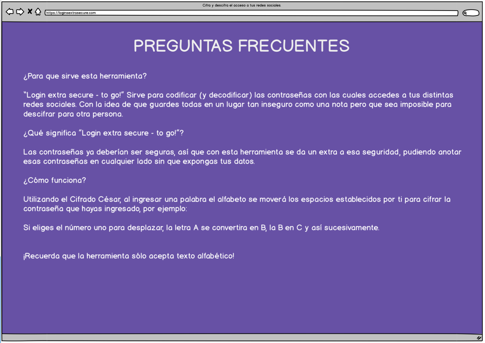

* # Logins Extra Secure - To Go! 

 GitHub Pages URL: [link to github pages!](https://dianax69.github.io/CDMX009-cipher/src/)

## ÍNDICE

* [1. Descripción del Proyecto](#1-descripción)
* [2. Investigación UX:](#2-investigación-ux)
* [3. Prototipo en papel](#3-prototipo-en-papel)
* [4. Feedback recibido](#4-feedback-recibido)
* [5. Wireframe](#5-wireframe)
* [6. Protopito final](#6-prototipo-final)
***

## 1. Descripción

Las contraseñas ya deben ser seguras pero agregamos una seguridad extra al almacenarlas en un lugar tan expuesto como una nota en el celular o anotado en una libreta, esto la hace vulnerable pero sólo si se sabe descifrar.

## 2. Investigación UX:

* ¿A quienes va dirigida?

Esta herramienta es para personas que no saben donde almacenar de forma segura sus contraseñas, el objetivo es que si las tienen en un lugar vulnerable no cualquiera pueda saber la contraseña.

* ¿Qué problema soluciona?

Muchas apps solicitan un pago para almacenar inicios de sesión y otras nos parecen bastante inseguras al ser gratuitas. Con ésta app, los usuarios pueden anotar sus contraseñas incluso en el lugar más inseguro como una agenda personal pero sólo conociendo un número (elegido por el mismo usuario) podrá descifrar su contraseñas.

## 3. Prototipo en papel:

## 4. Feedback recibido:

Durante las sesiones de _feedback_ mis compañeras me dijeron que les gustaría que mi proyecto tuviera más páginas y que algunos botones desaparecieran para no confundirse con el uso de cada uno. También cambió el color, que al principio era amarillo y era molesto para algunas personas asi como la imagen general que no encajaba con el tema de mi proyecto.

## 5. Wireframe

Realicé en _Balsamiq_ mi prototipo final aunque no era interactivo ya que me estaba tomando demasiado tiempo y no avanzaba en el resto del proyecto, así que opté por hacer un _wireframe_ con todas las pantallas 

 

 

  

## 6.Prototipo Final

