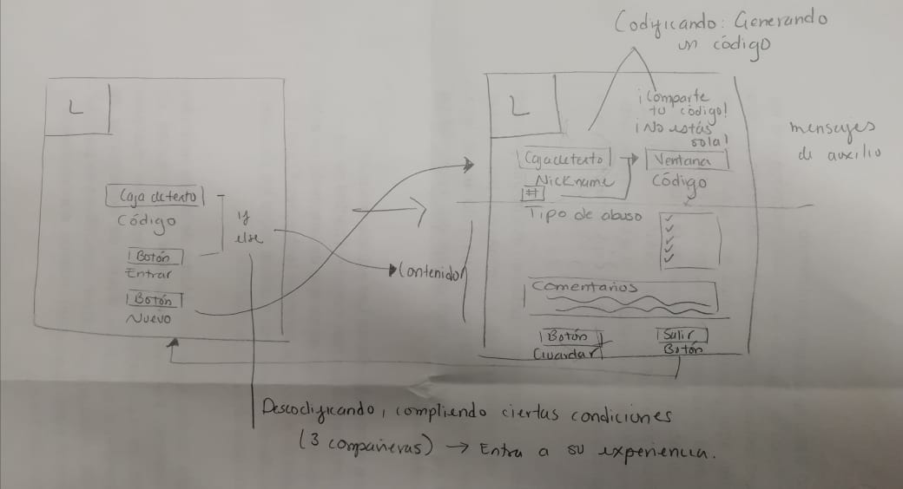

# CLÍO CODE

## Índice

* [1. Twit](#1-twit)
* [2. Resumen de la aplicación](#2-resumen-de-la-aplicación)
* [3. Instrucciones de uso] (#3-instrucciones-de-uso)
* [4. Objetivos de aprendizaje](#4-objetivos-de-aprendizaje)
* [5. Investigación UX](#5-investigación-ux)
***

## 1. Twit

"Ahora las mujeres tenemos un espacio seguro para compartir nuestras experiencias
y para pedir ayuda."

## 2. Resumen de la aplicación

Code clío nace por la necesidad de una red de confianza para mujeres que han
sufrido algún abuso; creemos en el poder de la comunicación como herramienta de
concientización.

Sabemos que toda experiencia traumática conlleva un proceso y que para sanar
primero debemos estar informadas y lograr identificar cuándo estamos siendo
abusadas. Además, en cuanto escribes sobre los detalles de tu historia y
reflexionas sobre lo ocurrido, haces un ejercicio de catarsis.

Cifrado César:

https://www.youtube.com/watch?v=sMOZf4GN3oc

## 3. Instrucciones de uso

### Confidencialidad:

Code Clío te solicita un nombre y un correo para mantener la red segura, por lo
que antes de enviarte tu número de folio te contactamos vía mail para
identificarte.

La herramienta de codificación de tu historia no requiere que ingreses datos
personales al momento de escribir tu historia.

### Compartiendo:

Si decides compartir tu historia, únicamente envía tu mensaje codificado
(el cual contendrá sólo letras mayúsculas y, agrega un número al final que será
el número de desplazamiento que hayas elegido al codificar tu historia, ejemplo:

                  [BSDLIHSDKBVHFDVBLFXKHVBHLXKFVBKHFVBKFXL
                  ÑKSDNFLSDNFKJVXCVJNFSKJVBFKDJVBÑKFJVBÑ6]

  •	Si decides compartir tu historia o la de alguien más con otra mujer, ella
  tendrá que hacer el mismo proceso que tú de identificación.

  •	Si decides solicitar apoyo emocional o ayuda jurídica, ya tendremos tus datos
  y ellos sabrán como ayudarte en caso de recibir un mensaje codificado con número
  de desplazamiento.

## 4. Objetivos de aprendizaje

Los objetivos logrados al desarrollar esta aplicación, fueron los siguientes:

### UX

- Diseñar la aplicación pensando y entendiendo al usuario.
- Crear prototipos para obtener feedback e iterar.
- Aplicar los principios de diseño visual (contraste, alineación, jerarquía).

### HTML y CSS

- Uso correcto de HTML semántico.*
- Uso de selectores de CSS.

### DOM

- Uso de selectores del DOM.
- Manejo de eventos del DOM.
- Manipulación dinámica del DOM.

### Javascript

- Manipulación de strings.
- Uso de condicionales (if-else | switch).
- Uso de bucles (for | do-while).    
- Uso de funciones (parámetros | argumentos | valor de retorno).
- Declaración correcta de variables (const & let).*

### Testing
- Testeo de tus funciones.

### Git y GitHub
- Comandos de git (add | commit | pull | status | push).
- Manejo de repositorios de GitHub (clone | fork | gh-pages*).

### Buenas prácticas de desarrollo
- Uso de identificadores descriptivos (Nomenclatura | Semántica).*

## 6. Investigación UX

### Usuarios y objetivos en relación con el producto

Clío Code está dirigido a mujeres de cualquier edad y nivel socioecónomico, de
modo que la aplicación en general resulta ser muy intuitiva.

Con respecto a la confidencialidad, Code Clío nació por la necesidad de accesar
a un espacio seguro al cuál no tengan acceso más que las mujeres que quieran
escribir acerca de sus experiencias o solicitar ayuda, en relación a esto último
es que existe un equipo de personas especializadas en ámbitos legales y psicológicos.

### Clío Code solucionando...

La app solicita un número de folio en una vista inicial sin dar mayores referencias
respecto al contenido. También en esta primer vista existe un enlace que te redirige
a un registro; la idea es que quien sea nueva se pueda registrar y, una vez enviando
sus datos, reciban un correo para darle seguimiento a la validación de su identidad;
con la identidad validada entonces ya se les otorga un número de folio con el
cuál ya se puede ingresar a la página.

La app consta de vistas páginas:

- ¿Clío Code?
Aquí se explica porqué nació Clío Code, en qué consiste el Cifrado César, la aplicación
en general y su funcionalidad.

- Encode-Decode
Aquí se encuentra la herramienta para codificar y decodificar tu historia.

- Apoyo
La red de apoyo de Clío Code se encuentra aquí.

### Primer prototipo en papel

### Resumen del feedback

Respecto al primer prototipo las dudas de mis compañeras de squad fueron muchas
y esto fue por mi falta de comunicación asertiva y, porque la segunda vista de
mi app estaba llena de muchos elementos visuales.

El feedback de los couches también versó en lo saturado que se encontraba mi
segunda vista.

De acuerdo a lo anterior es que decidí limpiar más los contenidos de mis vistas
y aunque se agregaran más vistas, el resultado fuese más claro.

## 5 Prototipo final

<video src="final-prototype.mp4">

#### Enlace final

 file:///C:/Users/alvar/Desktop/CDMX009-cipher/src/index.html
