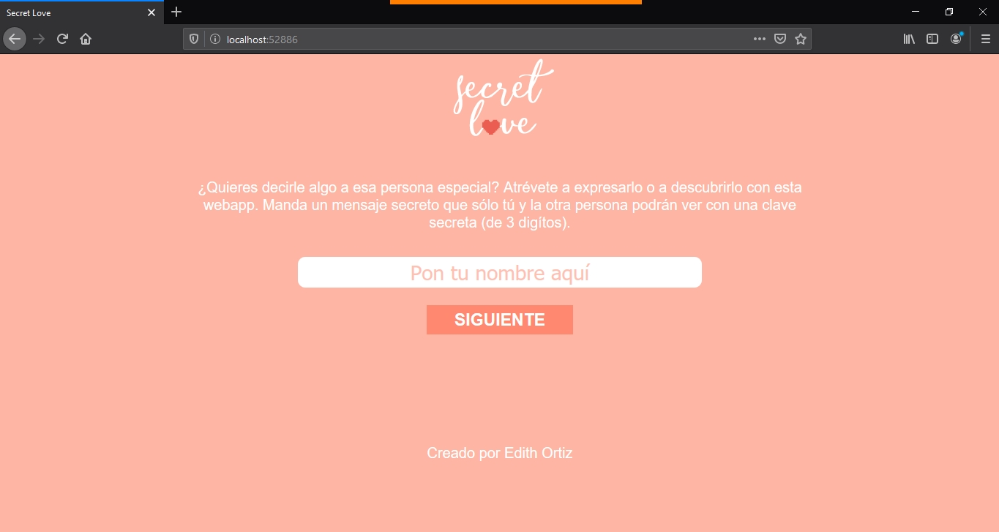
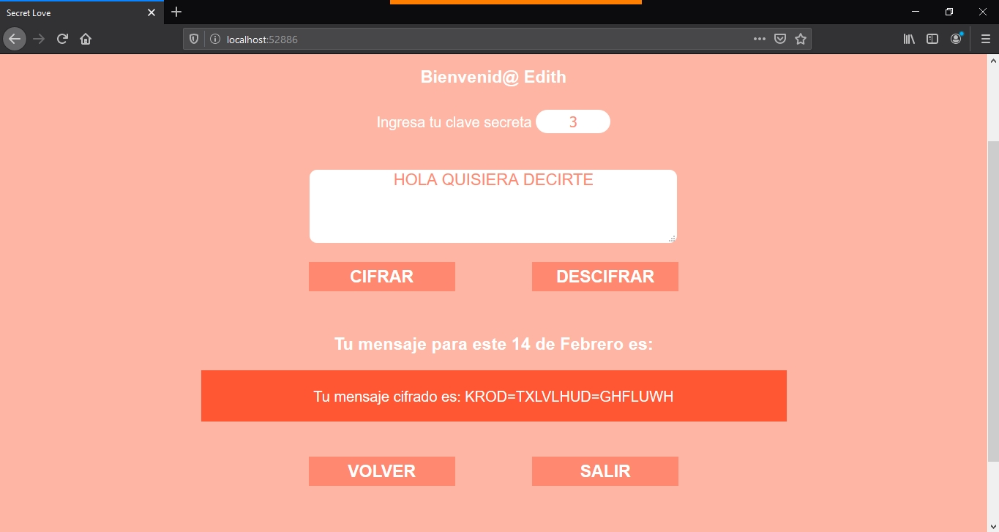
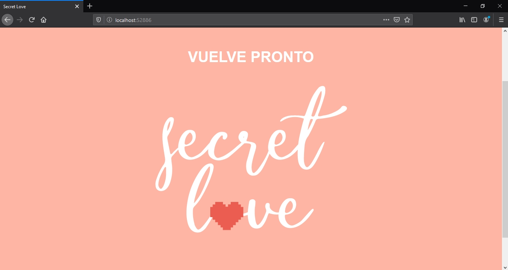
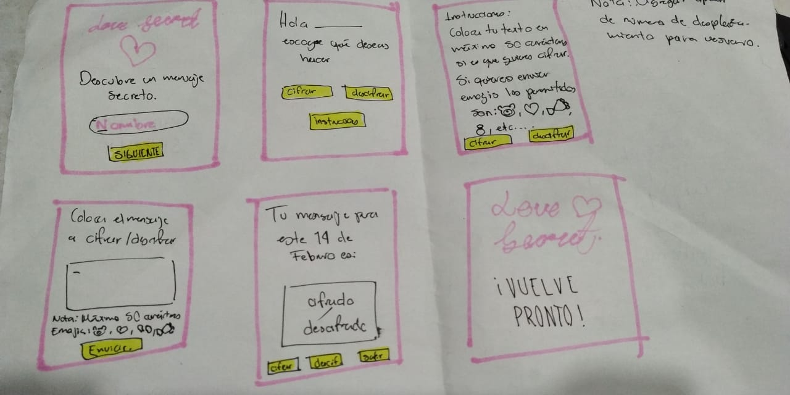
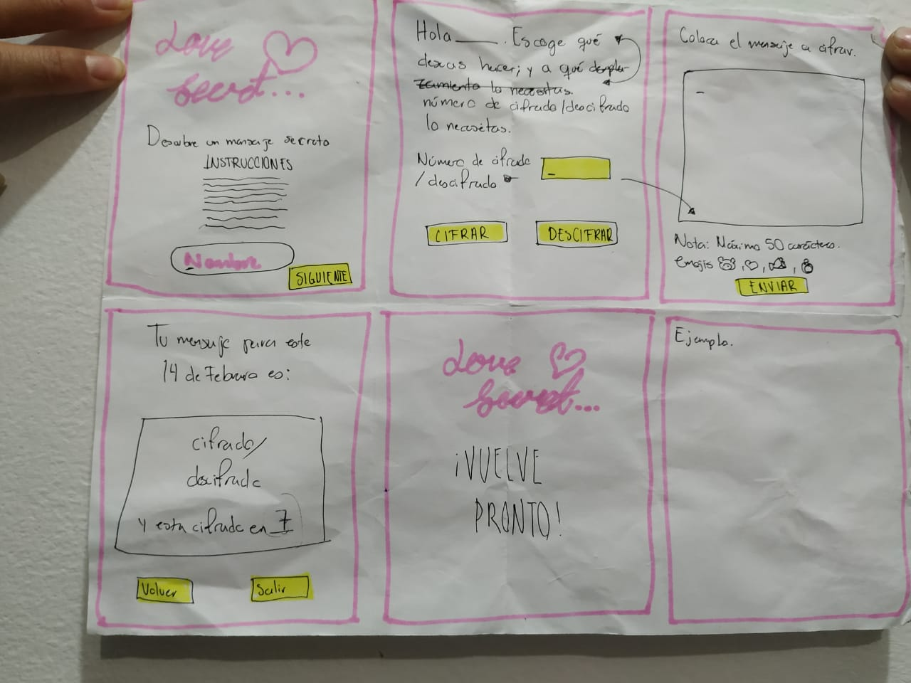
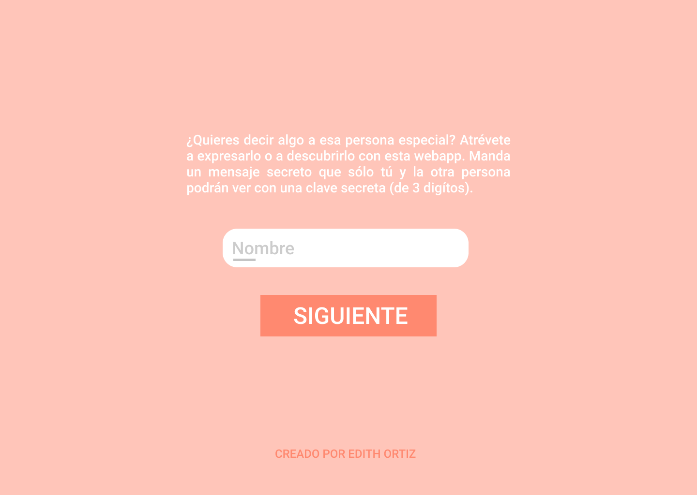
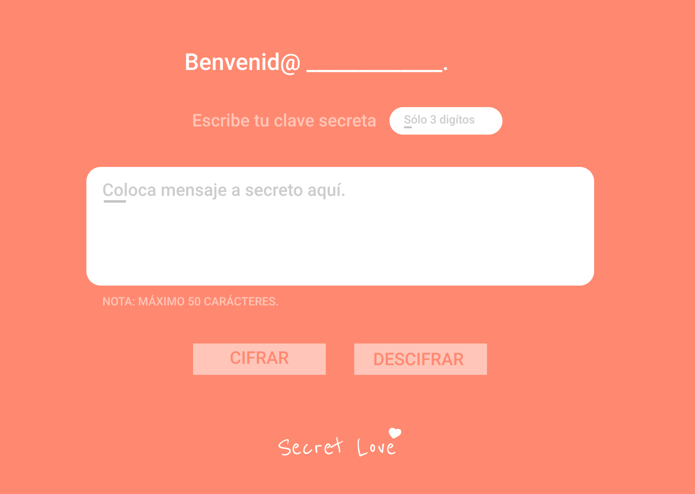
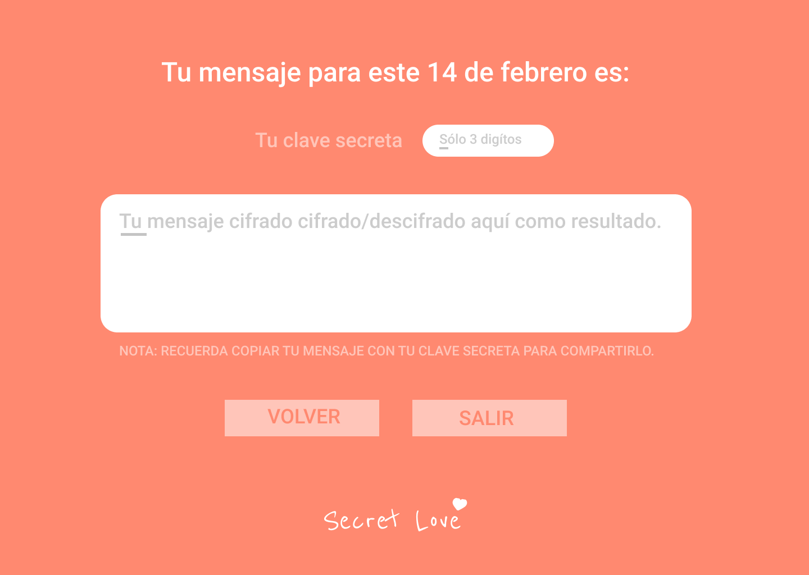

# Secret Love

## ¿Qué es Secret Love?

Es una WebApp gratuita adaptada para la festividad de San Valentín. Codifica mensajes para las personas que quieran puedan mantenerlo en secreto y así mismo compartirlo con alguien especial.

## Investigación UX.

* Los usuarios a los que va dirigida es a jóvenes entre los 17 y 30 años de edad. Tiene como objetivo el cifrar y descifrar mensajes que el usuario desee mandar a sólo una persona o varias personas en concreto con fin amistoso u amoroso. En tan sólo una fracción de segundos la persona que use Secret Love obtendrá su mensaje sin costo alguno y con una rápidez espectacular.

* Por ser gratuita y on line permite el fácil acceso a cualquier persona que requiera cifrar y/o descrifrar un mensaje. Es intuitiva y rápida si es que la persona no dispone con mucho tiempo para crear y/o descifrar su mensaje. No requiere de crear una cuenta para poder acceder al servicio de Secret Love.

* Como feedback se destacó el especificar hasta cuántos digítos utilizar para ingresar la clave secreta (desplazamiento), o bien delimitarlos en el código. Se recomendó utilizar menos pantallas para desarrollar la WebApp.

Por otra parte también se sugirió mostrar instrucciones más fáciles de comprender para el usuario y ligadas a la temática de San Valentín. Por último tratar de poner menos botones para que no fuera tan confuso los pasos a seguir.

## Imágenes de prototipo final

