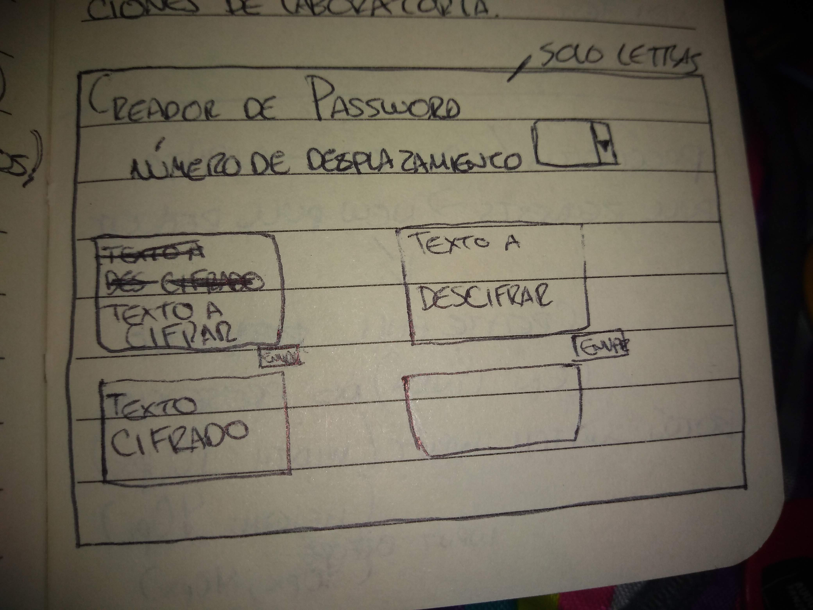

## Bienvenidos al creador de password

## Índice

<<<<<<< HEAD
* [1. Resumen del proyecto](#1-Resumen del proyecto)
* [2. Investigación UX](#2-Investigación UX)
* [3. Imagen de mi Prototipo en Papel](#3-Imagen de mi Prototipo en Papel)
* [4. Feedback](#4-Feedback)
* [5. Prototipo Final](#5-Prototipo Final)
* [6. La Imagen Final de mi Proyecto](#6-La Imagen Final de mi Proyecto)

***

## 1. Resumen del proyecto
Mi proyecto lo base para aquellas personas que ponen la misma contraseña en
todos lados y esta es una forma eficaz de mantener una seguridad de su
contraseña.

## 2. Investigación UX:
* Me puse en los zapatos del usuario y de acuerdo a feedbacks de mis compañeras
  pense que seria mejor tener solo una pagina para interactuar con la app,
  lo puede usar desde un adulto hasta un niño.
* Muchos de nosotros al querer manejar rapido nuestras redes sociales y demas,
  a veces tendemos por poner la misma contraseña para todo haciendo mas
  vulnerable nuestra seguridad, y haciendo correr el riesgo de que nuestra
  informacion sea violada, el creador de password facilita y promueve la maxima
  seguridad de tus redes sociales, creando contraseñas de forma facil y
  divertida.

## 3. Imagen de mi Prototipo en Papel

## 4. Feedback
Durante el Feedback con las compañeras y explicando mi idea del proyecto me
hicieron mención que mi app deberia tener menos palabras e ir directamente al
punto, por lo que decidi solo poner una primera pantalla de Advertencia y la
segunda para interactuar, en mi feedback con el coach me sugirio no poner tantos
recuadros de texto y agregar un botón "switch" que lamentablemente no pude ligar
a mis Eventos por lo que tuve que solucionar con "a href" en formas de iconos.

## 5. Prototipo Final

## 6. La Imagen Final de mi Proyecto.

