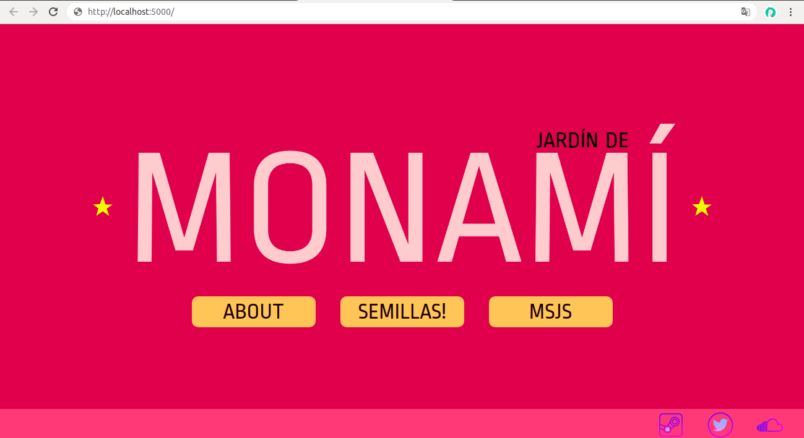
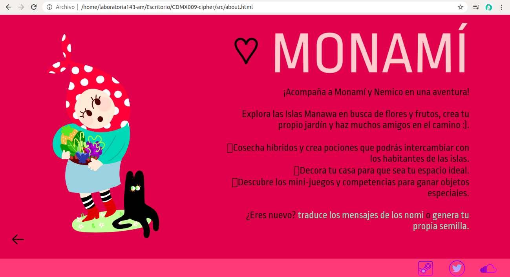
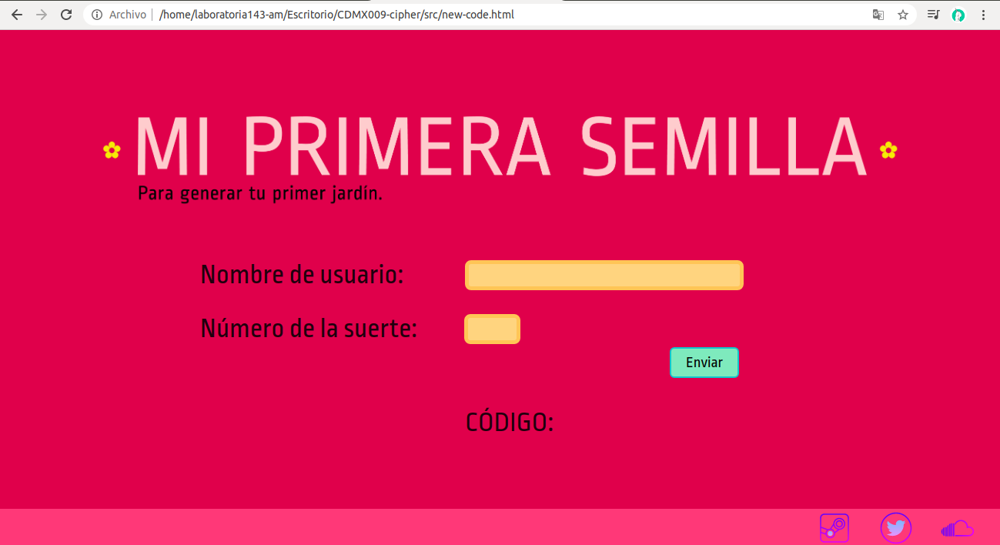
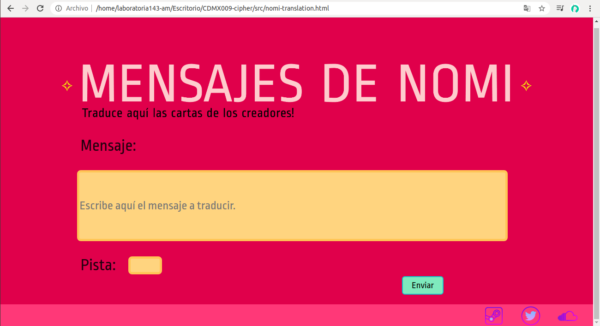
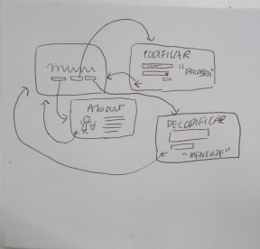
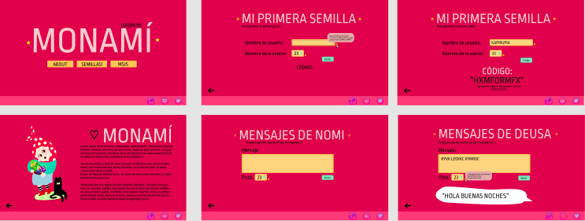

# Jardín de Monamí ☆

Monamí™ es un juego de rol que consiste en plantar y crear híbridos de flores y frutas, con el fin de socializar, crear o intercambiar objetos y ofrecerlos a los Nomi, creadores de las islas donde se desarrolla el juego. 

La página sirve como extensión del juego y para agregar interactividad. Consiste en tres secciones: 
    1. About: en donde se puede leer un poco sobre el universo de Monamí.
    2. Semillas!: en donde se podrá poner el nombre de usuario que genera una semilla de regalo para los jugadores nuevos.
    3. Msjs: en donde se podrán traducir los mensajes de los Nomi, ya que dentro del juego te hablan en código. 
    
**Pantallas finales:**

Index

About

Codificar

Decodificar

    
# Investigación UX

**Usuarios:** personas de 12 a 18 años que tengan interés en los videojuegos de simulación social.

La página sirve para agregar interactividad al juego y darle a los nuevos usuarios una idea de lo que los elementos que encontrarn en el mismo.

**Primer prototipo**

Recibí feedback en cuanto al diseño inicial que incluía circulos, y aunque era bonito visualmente, no se entendía mucho el propósito. 

**Prototipo final**

