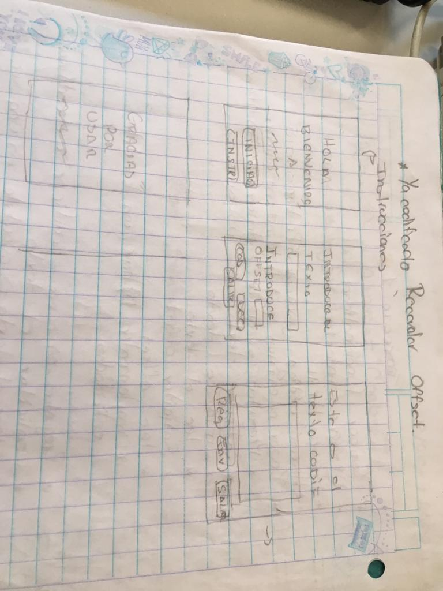
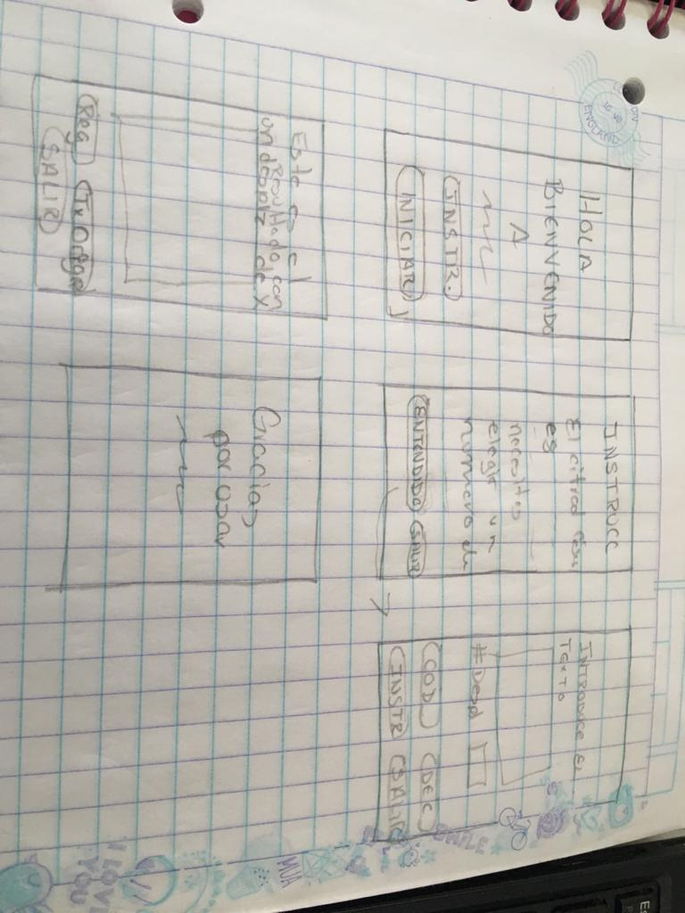
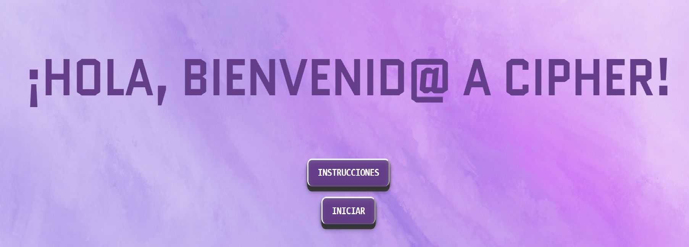

# CIPHER

## Índice

* [1. Resumen](#1-resumen)
* [3. Investigaciòn UX](#3-objetivos-de-aprendizaje)
* [4. Imágen final del proyecto](#4-consideraciones-generales)
* [5. Objetivos de aprendizaje](#5-criterios-de-aceptación-mínimos-del-proyecto)

***

## 1. Resumen

Cipher es un apalicacion que cifra y decifra un texto con el objetivo de enviar el mensaje mas tarde via redes sociales. se tiene que entrar a la aplicacion para cifrar y para decifrar este ùltimo usuario debe conocer el desplazamiento utilizado.

## 2. Investigación UX

  1. Explicar quiénes son los usuarios y los objetivos en relación con el producto.
      
      Como el fin es simplemente recreativo la publicación iría enfocada a um público mas bien joven que quiera  necesite enviar mensajes cifrados en sus redes sociales.

    
  2. Explicar cómo el producto soluciona los problemas/necesidades de dichos usuarios.

      Esta aplicación busca soluconar la necesidad de un público que por necesidad o simple entretenimiento busca enviar mensajes
      cifrados, esta aplicación cifra el mensaje que introduce el usuario para que este después lo envíe de igual forms decifra dicho mensaje.

   
  3. Luego colocarás la foto de tu primer prototipo en papel.

  

  4. Agregar un resumen del feedback recibido indicando las mejoras a realizar.

      Faltaban las instrucciones para quien no supiera que es el codigo cesar, y como funciona el cipher.

  5. Imagen del prototipo final.

 

## 3. Objetivos de aprendizaje

### UX

- [✓ ] Diseñar la aplicación pensando y entendiendo al usuario.

      Si, porque al recibir el feedback de mis posibles usuarios si comprendieron el uso de la aplicación.

- [✓ ] Crear prototipos para obtener feedback e iterar.

       Por que hice las adecuaciones recibidas después del feedback de diferentes compañeras.

- [ ] Aplicar los principios de diseño visual (contraste, alineación, jerarquía).

      Me falta mejorar en diseño.

### HTML y CSS

- [ ] Uso correcto de HTML semántico.
     
- [✓ ] Uso de selectores de CSS.

      Si por que utilice varios y entendí cuando se debe usar punto, cuando gato y cuando va solo el nombre de la etiqueta.

- [ ] Construir tu aplicación respetando el diseño realizado (maquetación).

      El diseño final fue un tanto diferente de mi prototipo porque lo iba mejorando.

### DOM

- [✓ ] Uso de selectores del DOM.

  [✓ ] Manejo de eventos del DOM.
- [ ] Manipulación dinámica del DOM.

### Javascript

- [✓ ] Manipulación de strings.
- [✓ ] Uso de condicionales (if-else | switch).
- [✓ ] Uso de bucles (for | do-while).    
- [✓] Uso de funciones (parámetros | argumentos | valor de retorno).
- [✓ ] Declaración correcta de variables (const & let).

### Testing
- [ ] Testeo de tus funciones.

### Git y GitHub
- [✓ ] Comandos de git (add | commit | pull | status | push).
- [✓ ] Manejo de repositorios de GitHub (clone | fork | gh-pages).

### Buenas prácticas de desarrollo
- [ ] Uso de identificadores descriptivos (Nomenclatura | Semántica).
- [✓ ] Uso de linter para seguir buenas prácticas (ESLINT).

  
