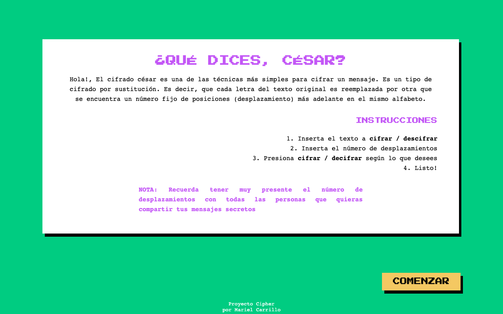
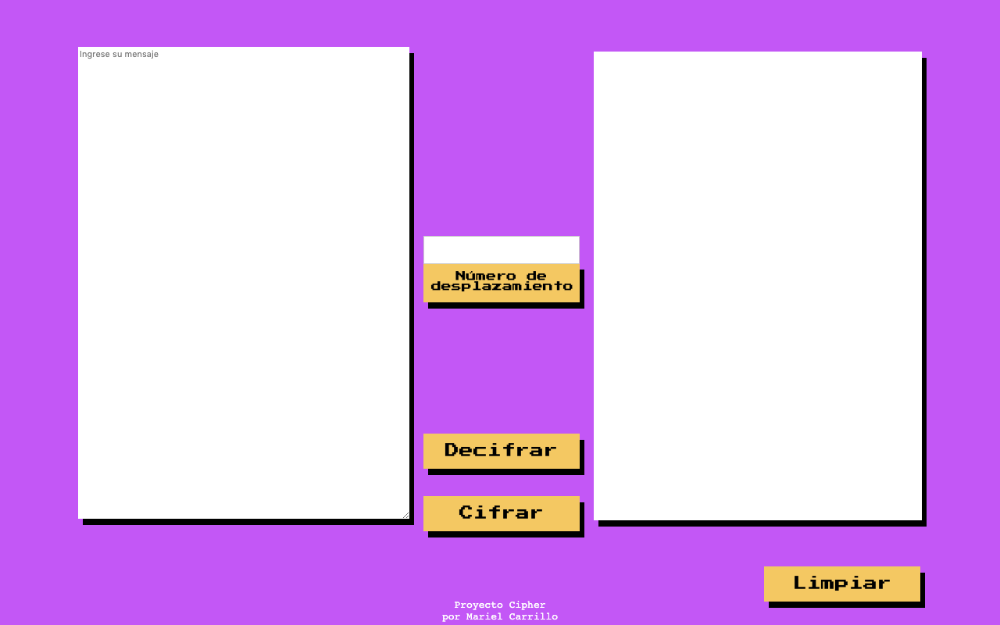
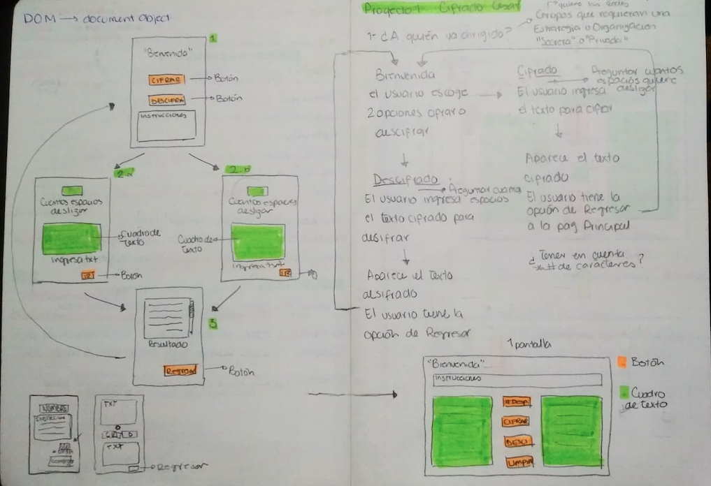
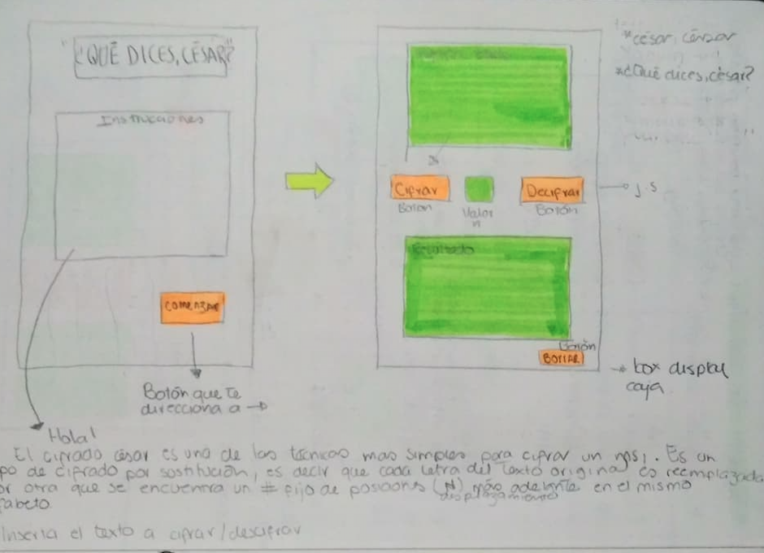

# ¿Qué dices, César?

## ¿Qué es?

Es un sitio web para todo tipo de personas que requieran compartir 
mensajes secretos o privados de forma rápida y fácil.

## Investigación UX

### ¿Para quién va dirigida?

¿Qué dices, César?, va dirigida a personas de cualquier edad. Desde compartir 
estrategias "privadas" con tu equipo de trabajo, organizar intercambios o 
dinámicas de grupo, hasta intercambiar mensajes "secretos" con tu pareja o amigos.
Tú decides qué compartir y con quién!.

### ¿Cómo funciona?

De fácil uso y acceso, contiene una breve explicación del cifrado a ejecutar, 
en este caso el [cifrado César](https://en.wikipedia.org/wiki/Caesar_cipher) y 
las instrucciones de uso. Lo único que deben recordar es el número de desplazamiento 
con el que harán su cifrado o decifrado 

### Feedback

En el proceso de feedback, se logró mejorar la localización de los botones principales 
para hacer el sitio web de más fácil acceso. También se redujeron el nuemro de pantallas a usar 
con el fin de no hacer el proceso de cifrado tedioso o confuso para el usuario.

### Prototipo final
http://g.recordit.co/LtIeXrcNz8.gif

### Objetivos de Aprendizaje

#### UX

- [·] Diseñar la aplicación pensando y entendiendo al usuario.
- [ ] Crear prototipos para obtener feedback e iterar.
- [·] Aplicar los principios de diseño visual (contraste, alineación, jerarquía).

#### HTML y CSS

- [·] Uso correcto de HTML semántico.
- [·] Uso de selectores de CSS.
- [·] Construir tu aplicación respetando el diseño realizado (maquetación).

#### DOM

- [·] Uso de selectores del DOM.
- [·] Manejo de eventos del DOM.
- [·] Manipulación dinámica del DOM.

#### Javascript

- [·] Manipulación de strings.
- [·] Uso de condicionales (if-else | switch).
- [·] Uso de bucles (for | do-while).    
- [·] Uso de funciones (parámetros | argumentos | valor de retorno).
- [·] Declaración correcta de variables (const & let).

#### Testing
- [ ] Testeo de tus funciones.

#### Git y GitHub
- [· ] Comandos de git (add | commit | pull | status | push).
- [ ] Manejo de repositorios de GitHub (clone | fork | gh-pages).

#### Buenas prácticas de desarrollo
- [· ] Uso de identificadores descriptivos (Nomenclatura | Semántica).
- [ ] Uso de linter para seguir buenas prácticas (ESLINT).

