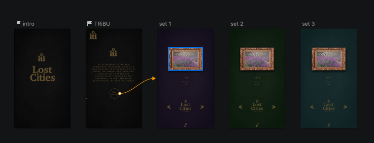
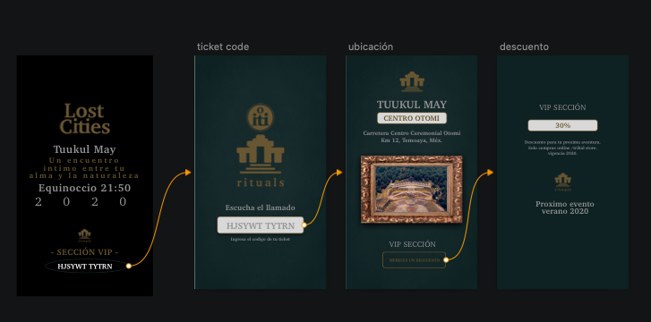

Lost City 

Es el imaginario de una comunidad entregada a sentir y experimentar la alternancia de lo vívido  de compartir y construir espacios que encapsulan experiencias a travez de los sentidos y la digitalización( encarnación ) de nuestro tiempo. 

La aplicación integra tres apartados donde el usuario podra encontrar espacios para:

- Exploración de conceptos y musica con su representación visual de cada Set.

- Store para compra de merchandising acerca del concepto de cada ritual.

- Apartado para obtener la ubicación del ritual. 

Apartador Rituals 

 En este espacio el usuario sigue una serie de paso para revelar la ubicación del lugar:
 
 1- El dato a usar se enceuntra en el ticket de compra. (codigo a cifrar).
 
 2- Ingresando el dato te revela la ubicación del lugar y toda la información acerca de el. 
 
 3- El descuento corresponde depediendo de la sección del ticket (decifrado); y se obtiene dando click en canjear. 
 
VIP - 30%
PISTA - 20%
GENERAL - 10%

PROTOTIPOS DE LA INTERFAZ 

### UX

- [ &#128076;&#127999;] Diseñar la aplicación pensando y entendiendo al usuario.
- [&#128076;&#127999;] Crear prototipos para obtener feedback e iterar.
- [&#128076;&#127999; ] Aplicar los principios de diseño visual (contraste, alineación, jerarquía).

### HTML y CSS

- [ &#128076;&#127999;] Uso correcto de HTML semántico.
- [&#128076;&#127999; ] Uso de selectores de CSS.
- [ &#128076;&#127999;] Construir tu aplicación respetando el diseño realizado (maquetación).

### DOM

- [ &#128076;&#127999;] Uso de selectores del DOM.
- [ &#128076;&#127999;] Manejo de eventos del DOM.
- [ &#128076;&#127999;] Manipulación dinámica del DOM.

### Javascript

- [&#128076;&#127999; ] Manipulación de strings.
- [  &#128076;&#127999;] Uso de condicionales (if-else | switch).
- [ ] Uso de bucles (for | do-while).    
- [&#128076;&#127999; ] Uso de funciones (parámetros | argumentos | valor de retorno).
- [&#128076;&#127999; ] Declaración correcta de variables (const & let).

### Testing
- [ ] Testeo de tus funciones.

### Git y GitHub
- [ &#128076;&#127999;] Comandos de git (add | commit | pull | status | push).
- [&#128076;&#127999; ] Manejo de repositorios de GitHub (clone | fork | gh-pages).

### Buenas prácticas de desarrollo
- [ ] Uso de identificadores descriptivos (Nomenclatura | Semántica).
- [ ] Uso de linter para seguir buenas prácticas (ESLINT).

#