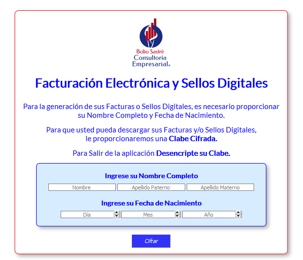
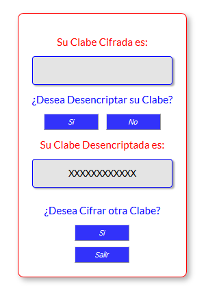
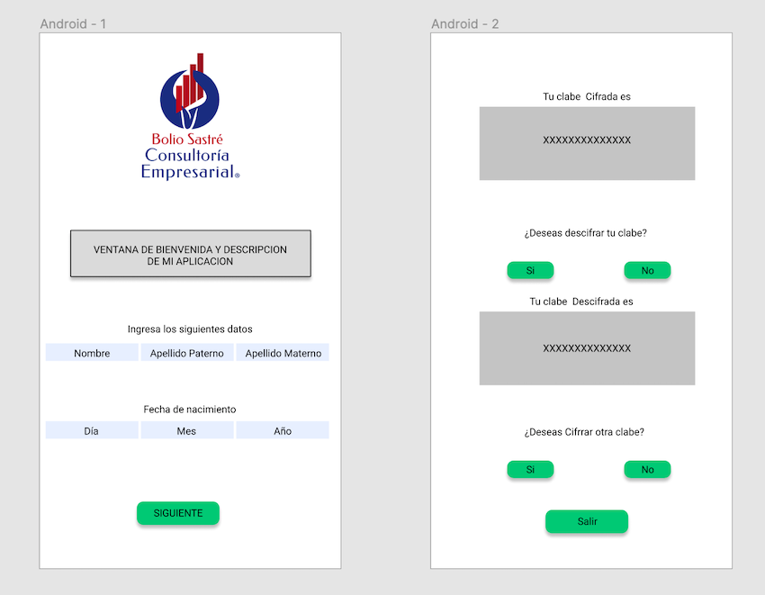

## TITULO DEL PROYECTO
**Cifrado César**

## RESUMEN DE LO QUE TRATA EL PROYECTO
Aplicacion para la generacion, descarga de facturas y sellos digitales.

## IMGENES FINALES DEL PROYECTO EN:

## INVESTIGACION UX
    i.- Contribuyentes (Personas fisicas y morales), que pagan impuestos y facturan sus productos y/o servicios.

    II.- Con esta aplicación y por medio de un despacho de contadores, obtener ante la SHCP la autorización para la generación de sellos digitales que incluye la facturación electrónica.

