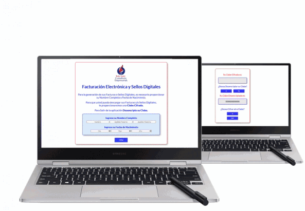

## PROYECTO
### ***Cifrado César***

**Aplicación diseñada para Desktop**

Aplicacion para la generacion, descarga de facturas y sellos digitales, por medio clabes cifradas.

## USUARIOS

- Contribuyentes (Personas fisicas y morales), que pagan impuestos y facturan sus productos y/o servicios.

- Con esta aplicación y por medio de un despacho de contadores, obtener ante la SHCP la autorización para la generación de sellos digitales que incluye la facturación electrónica.

## PROTOTIPO  

## IMGEN FINAL DEL PROYECTO:

## TECNOLOGIA UTILIZADA:

- HTML5
- CSS3
- Javascript

