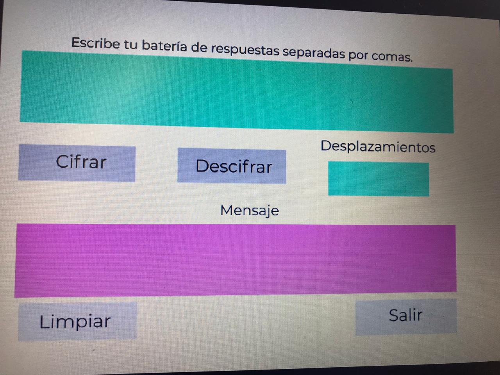

  # Cifrado César

## Safe tests

## 1.Safe tests

Mi app va dirigida al sector educativo, y funciona introduciendo en un cuadro de texto las respuestas de los examenes para ser devueltas en código.
 

## 2. UX

Los usuarios son maestros que diseñan examenes, el objetivo es tener las respuestas de esos examenes en código para que no se filtren.

La app te pide que introduzcas la información y el número de desplazamientos, presioes cifrar o descifrar y compara en una misma pantalla ambos mensajes.

## 3. Objetivos de aprendizaje

El objetivo principal de aprendizaje es adquirir experiencia desarrollando
aplicaciones web (WebApp) que interactúen con el usuario a través del navegador
y la lógica, utilizando HTML5, CCS3 y JavaScript como herramientas.

Reflexiona y luego marca los objetivos que has llegado a **entender** y **aplicar** en tu proyecto.

### UX

- [✓] Diseñar la aplicación pensando y entendiendo al usuario.
- [✓] Crear prototipos para obtener feedback e iterar.
- [ ] Aplicar los principios de diseño visual (contraste, alineación, jerarquía).

### HTML y CSS

- [✓] Uso correcto de HTML semántico.
- [✓] Uso de selectores de CSS.
- [ ] Construir tu aplicación respetando el diseño realizado (maquetación).

### DOM

- [ ] Uso de selectores del DOM.
- [ ] Manejo de eventos del DOM.
- [ ] Manipulación dinámica del DOM.

### Javascript

- [ ] Manipulación de strings.
- [ ] Uso de condicionales (if-else | switch).
- [ ] Uso de bucles (for | do-while).    
- [ ] Uso de funciones (parámetros | argumentos | valor de retorno).
- [ ] Declaración correcta de variables (const & let).

### Testing
- [ ] Testeo de tus funciones.

### Git y GitHub
- [ ] Comandos de git (add | commit | pull | status | push).
- [ ] Manejo de repositorios de GitHub (clone | fork | gh-pages).

### Buenas prácticas de desarrollo
- [ ] Uso de identificadores descriptivos (Nomenclatura | Semántica).
- [ ] Uso de linter para seguir buenas prácticas (ESLINT).

