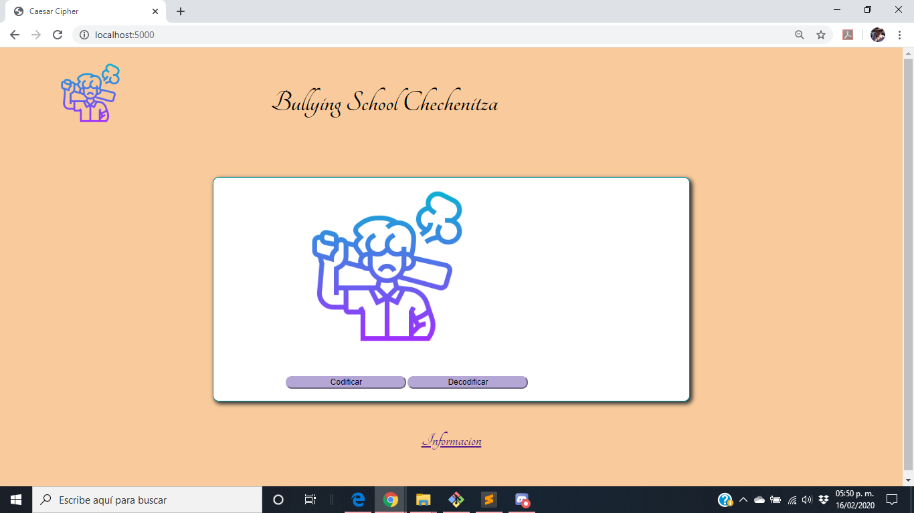
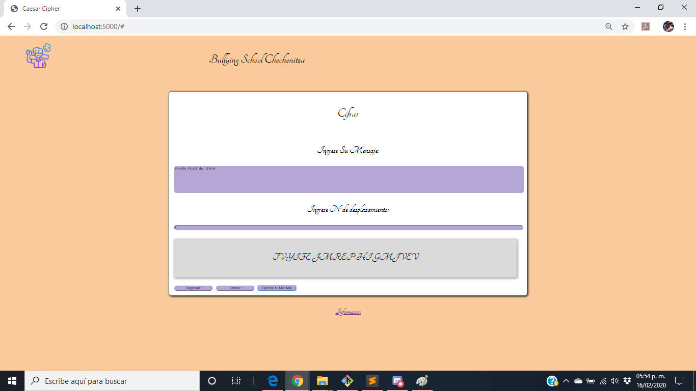
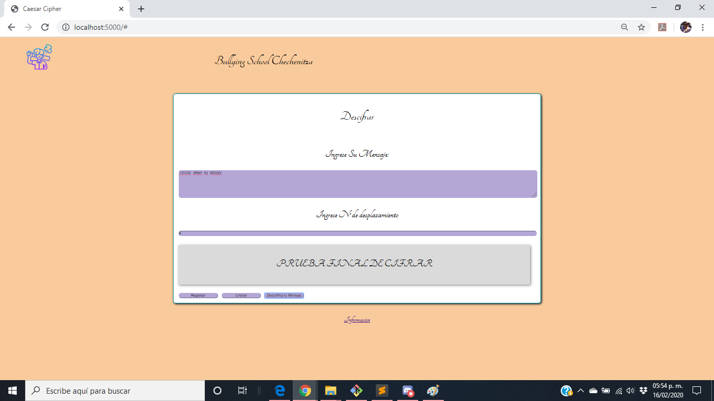
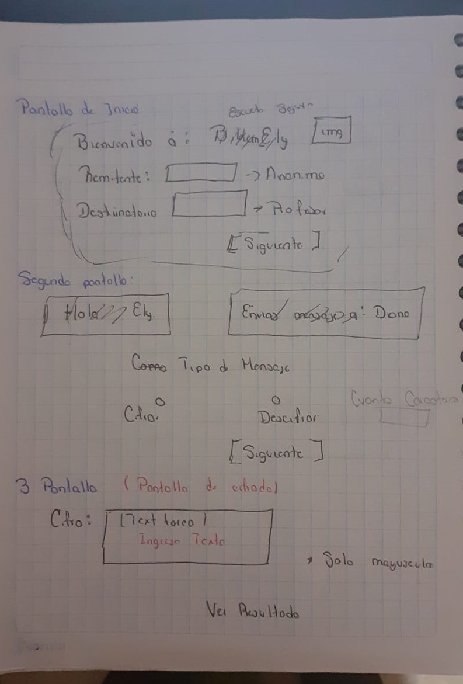
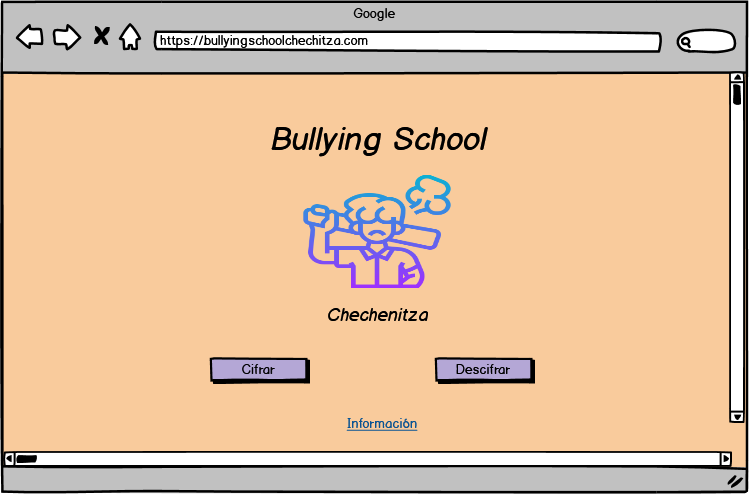
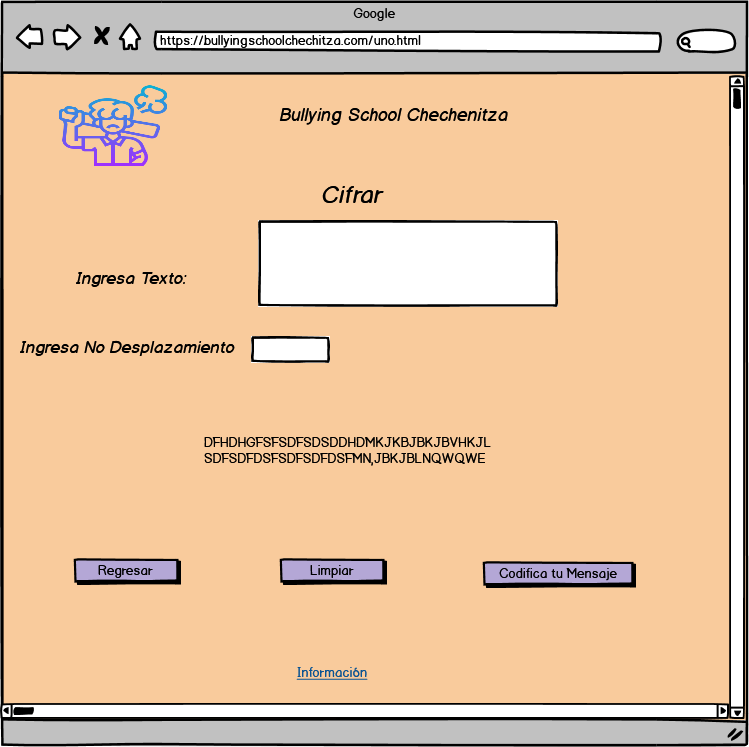
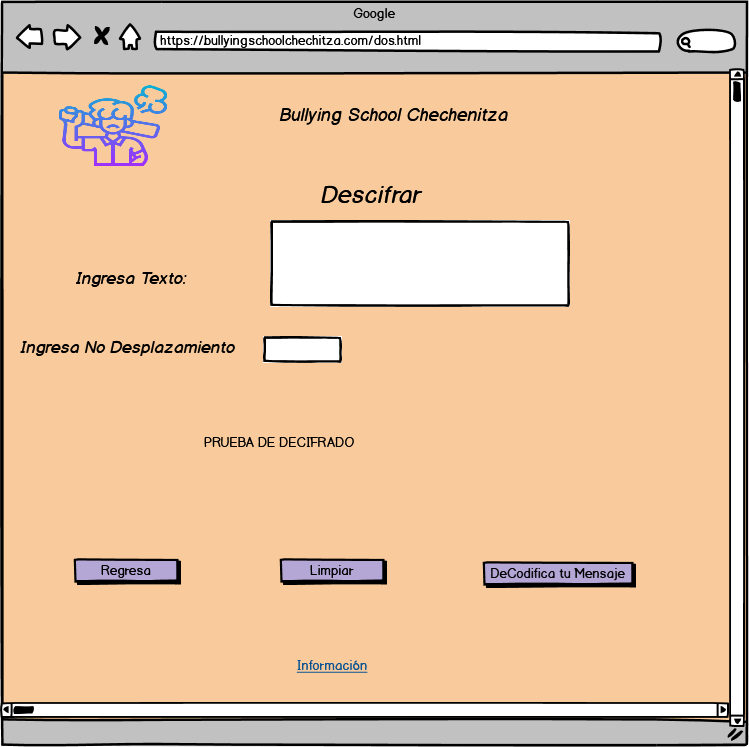

#1 Titulo 
Bullying School

#2 Resumen 
Bullying School se utiliza para enviar mensaje ocultos a los profesores, cuando los estudiantes son amenazados y tienen
miedo de expresarlo a un profesor o tutor 

#3 Imagen 

## Vistas

#i 
El proyecto va dirigido para los alumnos que son amenazados, dentro de instuciones y tiene miedo 
a decir o expresarlo

#ii
A través del cifrado se puede enviar los mensanjes a profesores y puedean ser ayudados.

#iii Sketch

#iv 
Reducir el diseño, ya que estaba a 6 pantallas, no colocar el nombre del que lo envia, ya que debe de ser animo.
Colocar el boton de regresar o inicio.
En JavaScript utilizar codigo o comando actualizados, ya que estaba trabajando con javascript atrasado.

#v Prototipo Balsamiq

## Intrucciónes de uso

### Para Cifrar:

* Ingresar texto a cifrar.

* Elegir un número de desplazamiento.

* Oprime boton "codifica tu mensaje".

* Recibe tu mensaje codificado.

* Oprime boton "limpiar" para refrescar y volver a utilizar.

* Si se requiere regresar al inicio, oprimi regresar

### Para Descifrar:

* Ingresar texto a descifrar.

* Elegir un número de desplazamiento (el mismo que se utilizo para codificar).

* Oprime boton "decodifica tu mensaje".

* Recibe tu mensaje decodificado.

* Oprime boton "limpiar" para refrescar y volver a utilizar.

* Si se requiere regresar al inicio, oprimi regresar

## Enlace Deploy

https://github.com/ElizaFlores11/CDMX009-cipher/blob/master/src/index.html

