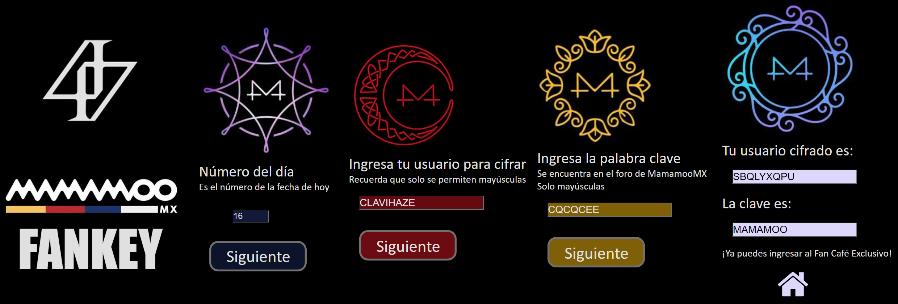
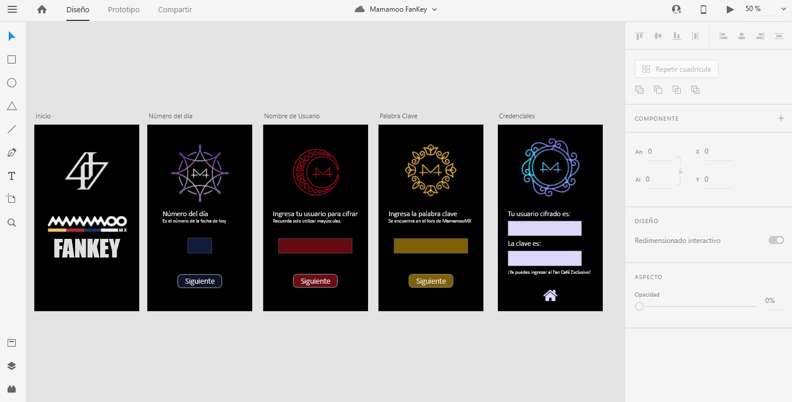

# Mamamoo FanKey

Esta es una aplicación para tener las claves de un sitio exclusivo. Permite
cifrar el nombre de usuario y descifrar la contraseña del día.

Los usuarios son miembros de un club de fans exclusivo de un grupo de K-pop donde pued0
en interactuar directamente las idols.

Utilizarian las claves para evitar que se use su usuario solo por conocer su nombre y una palabra clave diaria que se daría de forma secreta a través de los foros normales.

El primer prototipo incluía las cuatro pantallas donde en cada una se ingresa el número de offset, el usuario a codificar y la palabra clave a decodificar, con una pantalla de resultados al final.

