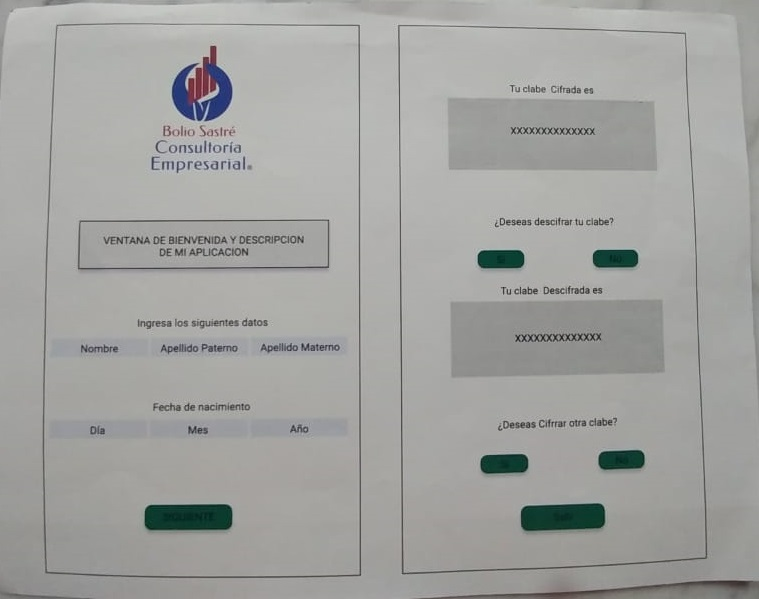

# TITULO DEL PROYECTO
**Cifrado César**

# RESUMEN DE LO QUE TRATA EL PROYECTO
Aplicacion para la generacion y descarga de facturas y sellos digitales.

# iMGENES FINALES DEL PROYECTO EN:

# INVESTIGACION UX
    i.- Contribuyentes (Personas fisicas y morales), que pagan impuestos y facturan sus productos y/o servicios.

    ii.- Con esta aplicación y por medio de un despacho de contadores, obtener ante la SHCP la autorización para la generación de sellos digitales que incluye la facturación electrónica.

    iii.- 
    

    iv.- 

    v.- 
    

