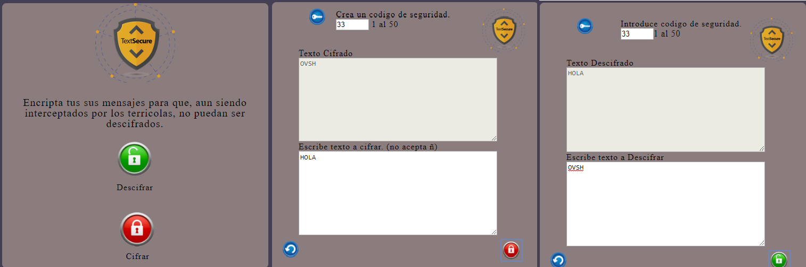
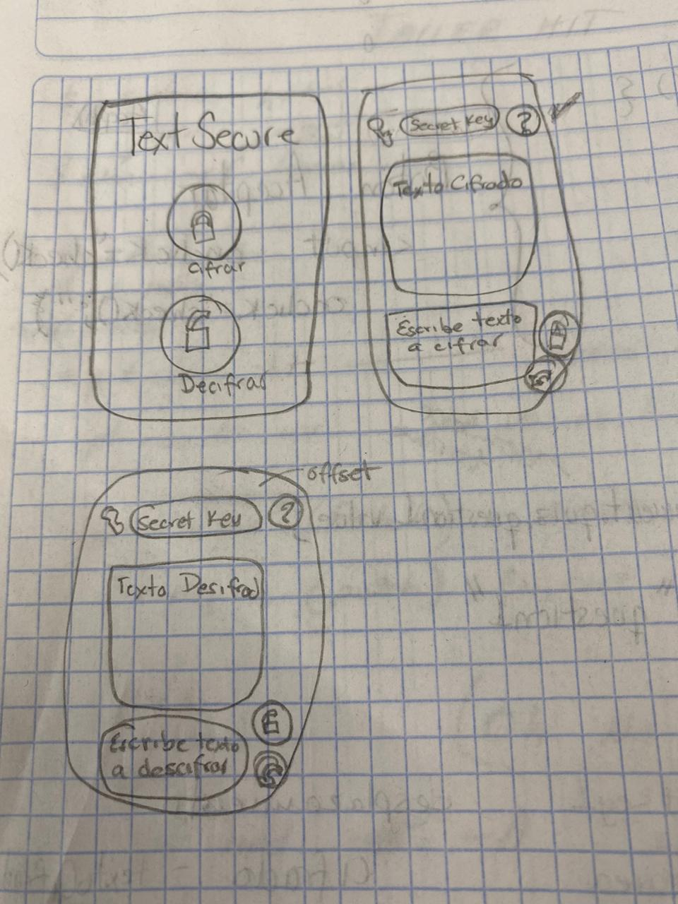
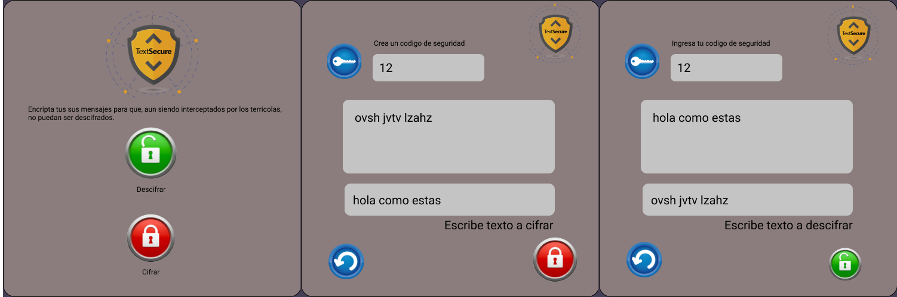

# TextSecure

* Encripta tus sus mensajes para que, aun siendo interceptados por los terricolas, no puedan ser descifrados.

# Proyecto Final

* TextSecure esta diseñado para las empresas que manejan información confidencial tal como datos personales. Siendo que dentro de la propia empresa existe fuga de información. Los empleados podrán comunicarse entre ellos, sin que nadie mas pueda entenderlo teniendo un código para descifrar cada mensaje.

* Los empleados de la empresa podran tener comunicacion segura, el objetivo es que no exista fuga de informacion.

* Este producto ayuda a los empleados cuando quieren usar informacion sensible como datos personales.

# Prototipo en papel

* Las mejoras a realizar a mi producto es: Que descifre caracteres especiales como (?¡¿{]}´#$).

# Prototipo en Figma

