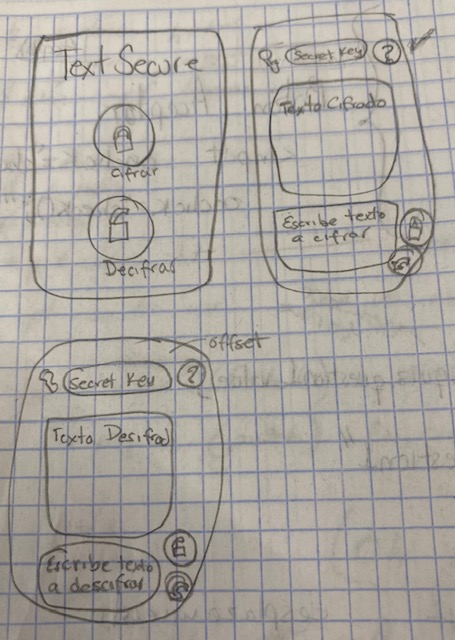

## 3. Objetivos de aprendizaje

### UX

- [+] Diseñar la aplicación pensando y entendiendo al usuario.
- [+] Crear prototipos para obtener feedback e iterar.
- [+] Aplicar los principios de diseño visual (contraste, alineación, jerarquía).

### HTML y CSS

- [ ] Uso correcto de HTML semántico.
- [ ] Uso de selectores de CSS.
- [+] Construir tu aplicación respetando el diseño realizado (maquetación).

### DOM

- [+] Uso de selectores del DOM.
- [+] Manejo de eventos del DOM.
- [ ] Manipulación dinámica del DOM.

### Javascript

- [+] Manipulación de strings.
- [+] Uso de condicionales (if-else | switch).
- [+] Uso de bucles (for | do-while).    
- [+] Uso de funciones (parámetros | argumentos | valor de retorno).
- [+] Declaración correcta de variables (const & let).

### Testing
- [+] Testeo de tus funciones.

### Git y GitHub
- [+] Comandos de git (add | commit | pull | status | push).
- [+] Manejo de repositorios de GitHub (clone | fork | gh-pages).

### Buenas prácticas de desarrollo
- [ ] Uso de identificadores descriptivos (Nomenclatura | Semántica).
- [ ] Uso de linter para seguir buenas prácticas (ESLINT).

# TextSecure

* Encripta tus sus mensajes para que, aun siendo interceptados por los terricolas, no puedan ser descifrados.

# Proyecto Final

* TextSecure esta diseñado para las empresas que manejan información confidencial tal como datos personales. Siendo que dentro de la propia empresa existe fuga de información. Los empleados podrán comunicarse entre ellos, sin que nadie mas pueda entenderlo teniendo un código para descifrar cada mensaje.

* Los empleados de la empresa podran tener comunicacion segura, el objetivo es que no exista fuga de informacion.

* Este producto ayuda a los empleados cuando quieren usar informacion sensible como datos personales.

# Prototipo en papel

* Las mejoras a realizar a mi producto es: Que descifre caracteres especiales como (?¡¿{]}´#$).

# Prototipo en Figma

